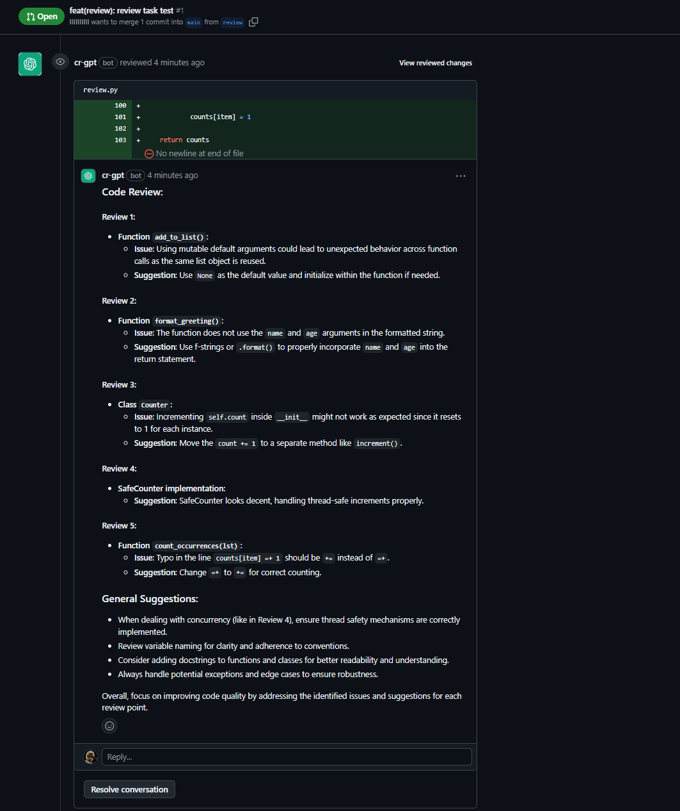

# Code Review Analysis Report

## Overview

This document provides a detailed analysis of five Python code snippets, identifying issues and proposing solutions with explanations.

## Preface

I usually configure a GitHub workflow for code review, so that LLM can automatically review the code of each PR as an aid. Not 100% accurate, but it's a good starting point.



## Review 1

```python
# Original Code
def add_to_list(value, my_list=[]):
    my_list.append(value)
    return my_list
```

### Issues:

1. **Mutable Default Argument**
   - Python creates default arguments when the function is defined, not when it's called
   - The same list object is reused across function calls
   - This leads to unexpected behavior where values accumulate

### Demonstration:

```python
# Problem Demonstration
print(add_to_list(1))  # Output: [1]
print(add_to_list(2))  # Output: [1, 2] (Unexpected!)
print(add_to_list(3))  # Output: [1, 2, 3] (Unexpected!)
```

### Solution:

```python
def add_to_list(value, my_list=None):
    if my_list is None:
        my_list = []
    my_list.append(value)
    return my_list
```

## Review 2: String Formatting

```python
# Original Code
def format_greeting(name, age):
    return "Hello, my name is {name} and I am {age} years old."
```

### Issues:

1. **Incorrect String Formatting**
   - Format placeholders are not properly formatted
   - Variables won't be substituted into the string

### Demonstration:

```python
# Problem Demonstration
print(format_greeting("John", 25))
# Output: "Hello, my name is {name} and I am {age} years old."
```

### Solution:

```python
def format_greeting(name, age):
    return f"Hello, my name is {name} and I am {age} years old."
    # Alternative: return "Hello, my name is {} and I am {} years old.".format(name, age)
```

## Review 3: Class Variable vs Instance Variable

```python
# Original Code
class Counter:
    count = 0

    def __init__(self):
        self.count += 1

    def get_count(self):
        return self.count
```

### Issues:

1. **Class Variable Misuse**
   - `count` is defined as a class variable (shared among all instances)
   - `self.count += 1` modifies the instance variable, not the class variable
   - Creates confusion between class and instance variables

### Demonstration:

```python
# Problem Demonstration
c1 = Counter()
c2 = Counter()
print(c1.get_count())  # Unexpected behavior
print(c2.get_count())  # Unexpected behavior
```

### Solution:

```python
class Counter:
    def __init__(self):
        self.count = 0  # Instance variable
        self.increment()

    def increment(self):
        self.count += 1

    def get_count(self):
        return self.count
```

## Review 4: Thread Safety

```python
# Original Code
class SafeCounter:
    def __init__(self):
        self.count = 0

    def increment(self):
        self.count += 1
```

### Issues:

1. **Race Condition**
   - Despite the name "SafeCounter", the class is not thread-safe
   - Multiple threads can access and modify `count` simultaneously
   - This leads to lost updates and race conditions

### Solution:

```python
import threading

class SafeCounter:
    def __init__(self):
        self.count = 0
        self._lock = threading.Lock()

    def increment(self):
        with self._lock:
            self.count += 1
```

### Demonstration:

```python
# Testing Thread Safety
def test_thread_safety():
    unsafe_counter = SafeCounter()  # Original version
    safe_counter = SafeCounter()    # Fixed version

    def worker(counter, num_iterations=1000):
        for _ in range(num_iterations):
            counter.increment()

    # Test with multiple threads
    threads = []
    num_threads = 10

    for counter in [unsafe_counter, safe_counter]:
        threads = []
        for _ in range(num_threads):
            t = threading.Thread(target=worker, args=(counter,))
            t.start()
            threads.append(t)

        for t in threads:
            t.join()

    print(f"Unsafe Counter: {unsafe_counter.count}")  # Likely < 10000
    print(f"Safe Counter: {safe_counter.count}")      # Exactly 10000
```

## Review 5: Assignment Operator

```python
# Original Code
def count_occurrences(lst):
    counts = {}
    for item in lst:
        if item in counts:
            counts[item] =+ 1  # Wrong operator
        else:
            counts[item] = 1
    return counts
```

### Issues:

1. **Incorrect Assignment Operator**
   - Uses `=+` instead of `+=`
   - `=+` is interpreted as `= (+1)`, always setting the value to positive 1
   - This leads to incorrect counting

### Demonstration:

```python
# Problem Demonstration
print(count_occurrences([1, 1, 2, 2, 2]))
# Expected: {1: 2, 2: 3}
# Actual: {1: 1, 2: 1}
```

### Solution:

```python
def count_occurrences(lst):
    counts = {}
    for item in lst:
        counts[item] = counts.get(item, 0) + 1
    return counts
```

---
