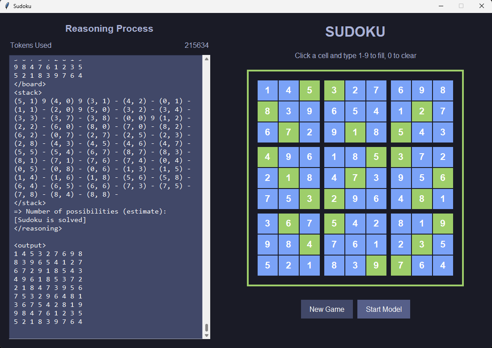

```{bash}
# Testing
python -m sudoku.tester -n 10 -d easy
python -m sudoku.tester -n 10 -d medium
python -m sudoku.tester -n 10 -d hard
python -m sudoku.tester -n 10 -d extreme

# Test super difficulty
python -m sudoku.tester -d inkala2006
python -m sudoku.tester -d inkala2010
```

| Difficulty Level | Coefficient | Numbers Removed | Description                                |
| ---------------- | ----------- | --------------- | ------------------------------------------ |
| Easy             | 0.3         | 30              | Easiest level to solve                     |
| Medium           | 0.5         | 40              | Moderate difficulty                        |
| Hard             | 0.7         | 50              | Challenging level                          |
| Extreme          | 0.9         | 55              | Close to minimum clues(17), most difficult |

Note: The calculation is based on max_to_remove = 64 (81 total cells - 17 minimum clues required for a unique solution)


https://github.com/Jellyfish042/Sudoku-RWKV.git
https://huggingface.co/blog/zh/rwkv
