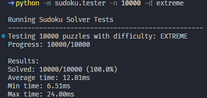

```{bash}
# Testing
python -m sudoku.tester -n 10 -d easy
python -m sudoku.tester -n 10 -d medium
python -m sudoku.tester -n 10 -d hard
python -m sudoku.tester -n 10 -d extreme

# Test extreme difficulty
python -m sudoku.tester -d inkala2006
python -m sudoku.tester -d inkala2010
```


