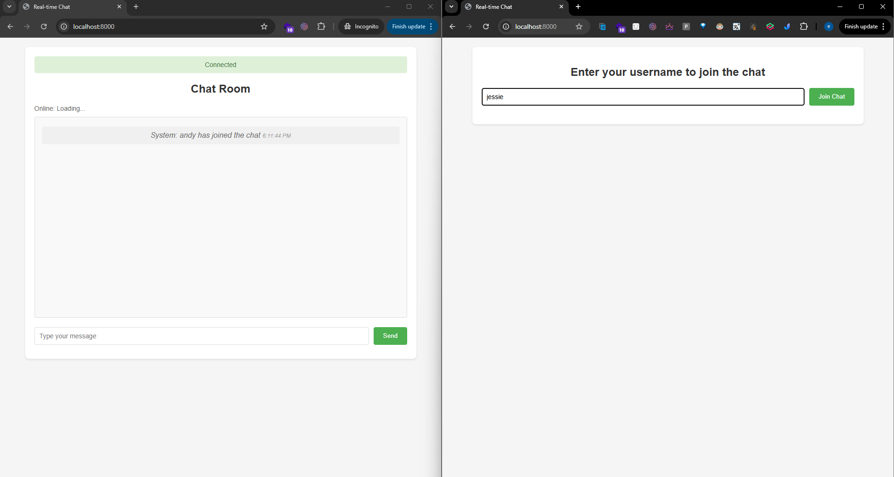
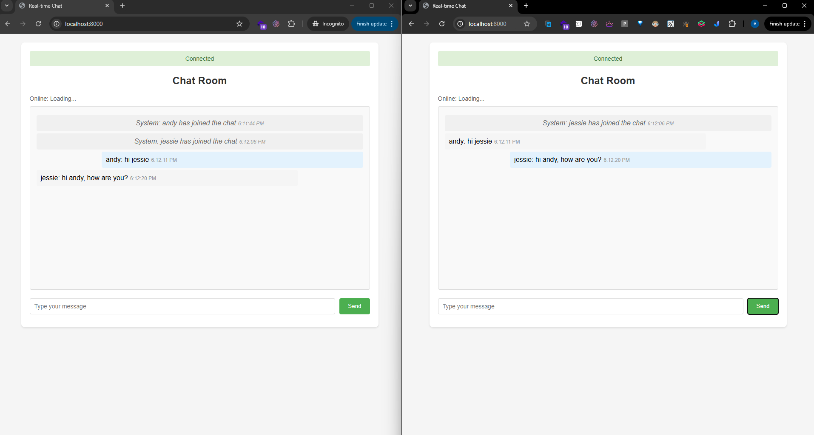
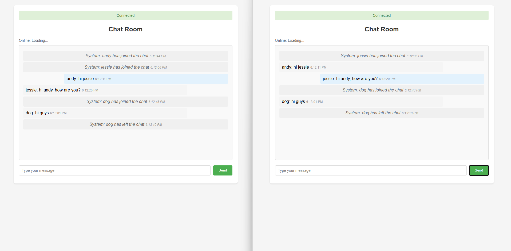

# Real-time Chat Application

A real-time chat application built with FastAPI and WebSocket, featuring multi-client support, username-based messaging, and graceful disconnection handling. Got a similar project done in university time, written in Java: https://github.com/IlIIIIIIlI/Canvas_privateloveapp, using sockets.

## Features

- ✨ Real-time messaging with WebSocket
- 👥 Multiple client support
- 🔰 Username-based connections
- 📨 Message broadcasting
- ⚡ Automatic reconnection
- 📝 Comprehensive logging
- 🔄 Graceful disconnection handling

## Project Structure

```
chat-app/
├── main.py                 # Application entry point
├── app/                    # Core application code
│   ├── __init__.py
│   ├── core/              # Core configurations
│   │   ├── __init__.py
│   │   ├── config.py      # Application settings
│   │   └── logging.py     # Logging configuration
│   ├── api/               # API endpoints
│   │   ├── __init__.py
│   │   └── websocket.py   # WebSocket handlers
│   └── services/          # Business logic
│       ├── __init__.py
│       └── chat.py        # Chat management service
├── static/                # Static files
│   └── index.html        # Frontend interface
├── logs/                  # Log files directory
├── requirements.txt       # Python dependencies
├── Dockerfile            # Docker configuration
└── docker-compose.yml    # Docker Compose configuration
```

## Requirements Fulfillment

1. Multiple Client Connections

   - Implemented through `ConnectionManager` class
   - Maintains active connections in a dictionary
   - Each client gets a unique session

2. Message Broadcasting

   - Real-time message distribution to all connected clients
   - Username-prefixed messages
   - System notifications for join/leave events

3. Username Management

   - Username validation on connection
   - Duplicate username prevention
   - Username persistence throughout session

4. Disconnection Handling
   - Graceful connection cleanup
   - Automatic reconnection attempts
   - System notifications for disconnections

## Installation & Running

### Using Python directly (Development)

1. Create virtual environment

```bash
python -m venv webapp
source webapp/bin/activate  # Linux/Mac
webapp\Scripts\activate     # Windows
```

2. Install dependencies

```bash
pip install -r requirements.txt
```

3. Run the application

```bash
uvicorn main:app --reload --host 0.0.0.0 --port 8000
```

### Using Docker (Recommended for Production)

```bash
# Build and start containers
docker-compose up --build

# Run in background
docker-compose up -d
```

## Accessing the Application

Open your browser and navigate to:

```
http://localhost:8000/
```

## Viewing Logs

### Direct Python Run

```bash
# Access log
tail -f logs/access.log

# Error log
tail -f logs/error.log

# WebSocket log
tail -f logs/websocket.log
```

### Docker Environment

```bash
# All logs
docker-compose logs -f

# Specific logs
docker-compose exec chat tail -f /app/logs/access.log
docker-compose exec chat tail -f /app/logs/error.log
docker-compose exec chat tail -f /app/logs/websocket.log
```

## Screenshots






## Development

### Prerequisites

- Python 3.11+
- Docker & Docker Compose (optional)

## Monitoring

The application provides comprehensive logging with three main log files:

- `access.log`: HTTP request logging
- `error.log`: Error tracking
- `websocket.log`: WebSocket connections and messages
